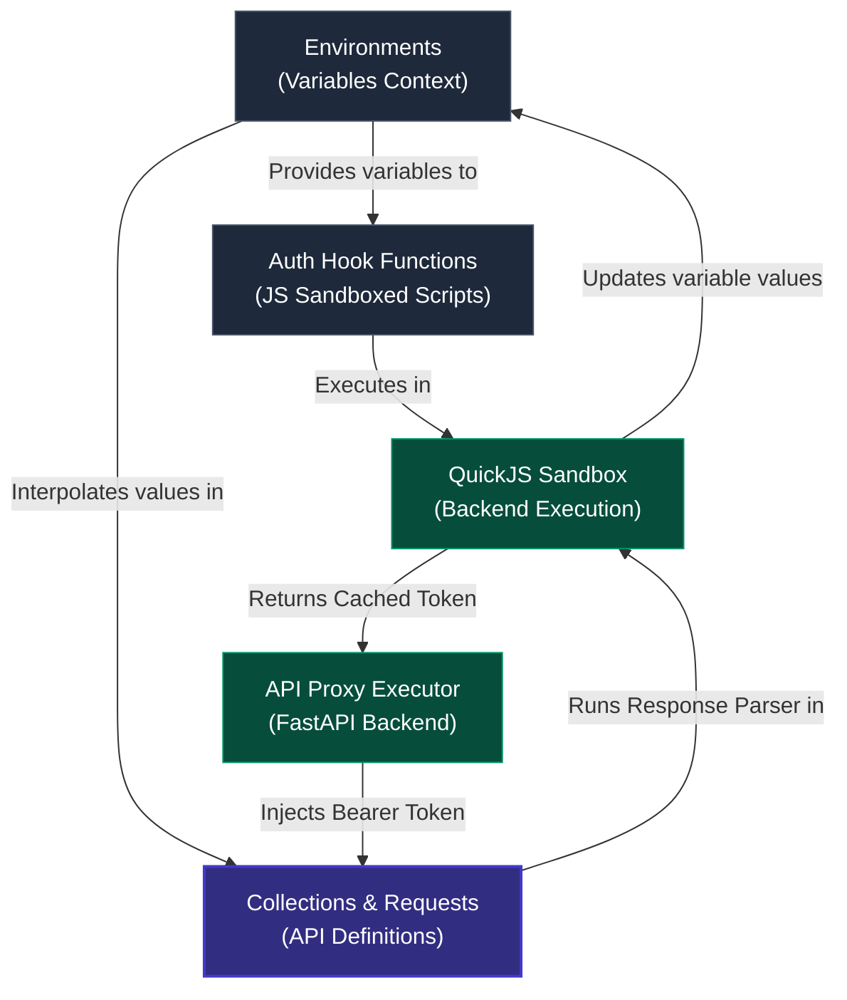

# API Explorer: User Flow & Dependency Guide

This document explains the **API Automation Explorer** module, its core dependencies (**Environments** and **Auth Hook Functions**), and the step-by-step user flow for executing requests and chaining variables.

---

## 1. Core Mental Model & Dependency Hierarchy

To effectively use the API Explorer, it is essential to understand the four key entities and how they relate:



1. **Environments**: The global context containing key-value variable sets (e.g., `BASE_URL`, `CLIENT_SECRET`). These variables can be referenced in any request or script using the double curly braces syntax: `{{VARIABLE_NAME}}`.
2. **Auth Hook Functions**: Programmatic JavaScript scripts executed inside a secure backend sandbox (QuickJS). They access Environment variables, make an HTTP call to retrieve an authentication token, and cache it according to a TTL (expires-in config) or the JWT's `exp` claim.
3. **Collections & Requests**: Stored HTTP request definitions (URL, Method, Headers, Query Params, Payload) grouped by folder/collection. They can reference Environment variables and designate an **Auth Hook Function** for dynamic authentication.
4. **Response Parser (Variables Chaining)**: A post-execution JavaScript script associated with a request. It extracts values from the HTTP response (e.g., an ID or a session token) and dynamically saves/updates them back into the active Environment for downstream requests.

---

## 2. Request Execution Lifecycle (Sequence Flow)

When you click the **Send** button on a request in the API Explorer, the backend goes through a structured execution loop:

```mermaid
sequenceDiagram
    autonumber
    actor User as QA Engineer
    participant FE as Frontend Client
    participant BE as Backend Proxy (FastAPI)
    participant DB as MongoDB
    participant JS as QuickJS Sandbox
    participant API as Target Host API

    User->>FE: Click "Send" Request
    FE->>BE: POST /api/executor/run (requestData, environmentId)
    
    rect rgb(30, 41, 59)
        note right of BE: Step 1: Interpolation
        BE->>DB: Fetch Environment variables
        DB-->>BE: Environment Variables
        BE->>BE: Interpolate variables in URL, Headers, and Body using {{key}}
    end

    rect rgb(49, 46, 129)
        note right of BE: Step 2: Resolve Authentication
        BE->>DB: Fetch associated Auth Hook details
        DB-->>BE: Auth Hook Script & cachedToken
        
        alt Cached Token is Missing or Expired
            BE->>JS: Execute Auth script with Env Context
            note over JS: Runs fetchToken() helper
            JS-->>BE: Returns newly fetched token string
            BE->>DB: Cache new token & expiresAt (TTL / JWT exp)
        else Token is Cached & Valid
            note over BE: Use cachedToken directly
        end
        BE->>BE: Inject header: 'Authorization: Bearer <token>'
    end

    rect rgb(6, 78, 59)
        note right of BE: Step 3: HTTP Dispatch
        BE->>API: Send HTTP Request (Method, URL, Headers, Body)
        API-->>BE: Return HTTP Response (Status, Headers, Body)
    end

    rect rgb(30, 41, 59)
        note right of BE: Step 4: Chaining (Response Parser)
        alt Response Parser Script exists AND Status < 400
            BE->>JS: Execute Response Parser script
            note over JS: Injects 'response' & 'vars'<br>Runs script calling vars.set()
            JS-->>BE: Returns extracted variables dictionary
            BE->>DB: Upsert extracted variables into Active Environment
        end
    end

    BE-->>FE: Return Execution Stats, Body, Headers & Extracted Variables
    FE->>User: Display Response & Extracted chips
```



---

## 3. Step-by-Step User Flow

### Step 1: Setup Workspace Environments
Before running requests, define your environment variables. 
1. Navigate to **Environments** (`/environments`) in the sidebar.
2. Click **Create Environment** and name it (e.g., `Staging`).
3. Add key-value variables:
   - Mark secrets (like passwords or client secrets) by checking the **Secret** box to mask them in the UI.
4. Set your active environment in the top header's **"Active Env"** dropdown.

### Step 2: Write an Auth Hook Function
If your APIs require bearer token authorization that expires frequently, define a dynamic hook:
1. Navigate to **Auth Hook Functions** (`/auth-functions`).
2. Click **Create Auth Function** and configure:
   - **Name**: e.g., `OAuth Client Credentials`
   - **Expires-In**: Set the cache lifetime in seconds (leave empty to parse from JWT expiration).
3. Write the JavaScript retrieval logic inside the Monaco editor.
4. Click **Create** to save.

*Example Auth Script:*
```javascript
// Access variables from the active environment using `env.<variable>`
const clientId = env.AUTH_CLIENT_ID;
const clientSecret = env.AUTH_CLIENT_SECRET;
const tokenUrl = env.AUTH_URL || "https://auth.staging.ninjavan.co/token";

// Use the fetchToken(url, options) helper to call the authentication server
const responseText = fetchToken(tokenUrl, {
  method: "POST",
  headers: {
    "Content-Type": "application/json"
  },
  body: JSON.stringify({
    client_id: clientId,
    client_secret: clientSecret,
    grant_type: "client_credentials"
  })
});

const res = JSON.parse(responseText);

if (res.error) {
  throw new Error("Auth request failed: " + res.error_description);
}

// Return only the string token to be cached
return res.access_token;
```

> [!TIP]
> Use the **Dry-run (Test)** feature inside the edit form to verify that your script executes successfully and outputs the expected token structure.

### Step 3: Build the Request in API Explorer
1. Navigate to **API Automation Explorer** (`/api-explorer`).
2. Create or select a Collection, and add a request.
3. Define the HTTP Method and URL (e.g., `{{BASE_URL}}/sg/order-search/search/masked`).
4. In the request builder's **Authentication** tab:
   - Select **Dynamic Auth Hook** as the authentication type.
   - Choose the Auth Function created in Step 2 from the dropdown.

### Step 4: Configure Variables Chaining
To feed fields from this response into downstream requests:
1. Open the **Variables Chaining** tab under the request builder.
2. Write a JavaScript snippet to extract values from the `response` object and save them using `vars.set(key, value)`.

*Example Parser Script:*
```javascript
// The backend injects the 'response' object containing parsed JSON body and headers
if (response.body && response.body.data && response.body.data.length > 0) {
  // Extract a specific ID from the response list
  const firstOrderId = response.body.data[0].id;
  
  // Set the variable. The backend updates the active environment automatically.
  vars.set("last_searched_order_id", firstOrderId);
}
```

> [!NOTE]
> You can click the **AI Agent Parser** button to open an AI assist window. Type in plain English what you want to extract (e.g., *"extract the order ID from the first element"*), and Gemini will generate the QuickJS-compliant script for you.

### Step 5: Execute and Verify
1. Click **Send**.
2. The response appears in the bottom panel. Under the **Extracted** tab, verify that any chained variables have been parsed.
3. Open another request and use the variable in the URL (e.g. `{{BASE_URL}}/orders/{{last_searched_order_id}}`). The API Explorer will interpolate the value automatically.

---

## 4. Key Differences: API Explorer vs. Web Explorer Auth Integration

While both modules share the same **Auth Hook Functions**, they inject the tokens differently depending on the execution context:

| Feature | API Explorer Request | Web Explorer Browser Session |
| :--- | :--- | :--- |
| **Execution Layer** | Headless backend `httpx` proxy | Remote Chromium browser (via VNC) |
| **Trigger Point** | Every time the **Send** button is clicked | Once upon establishing the VNC socket connection |
| **Token Injection** | Injected directly into the request headers (`Authorization: Bearer <token>`) | Pre-injected into the browser state (Cookies or LocalStorage) prior to navigating to the `defaultUrl` |
| **Caching Scope** | Cached in MongoDB per-user session | Resolved once at launch (renewed inside profile cookies/localStorage if expired) |
| **Setup Config** | Auth Function selected directly on the request | Auth Function linked to a **Browser Profile**, mapped with target keys and domains |
